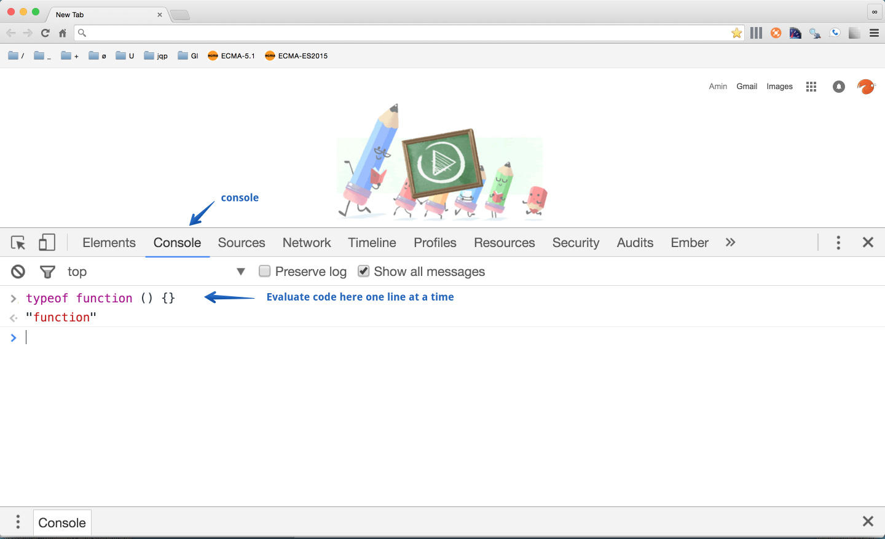
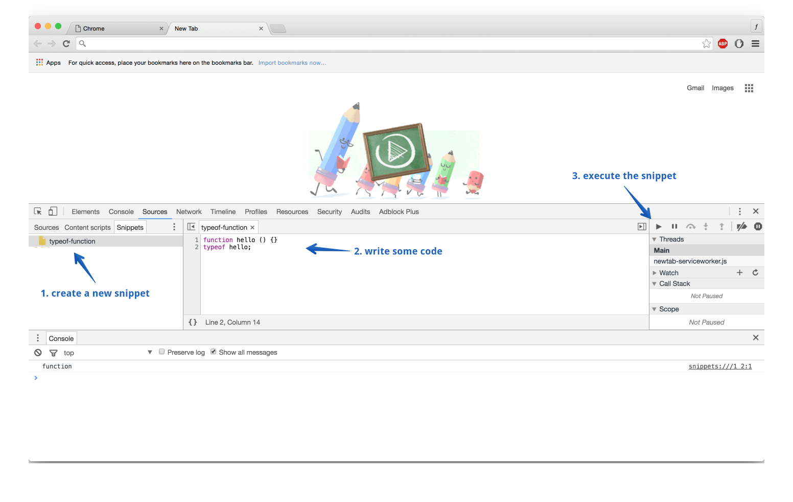

## Requirements

In order to follow along with the book, you need the following:

- Google Chrome
- Node > 5
- A text editor (Sublime Text is recommended, but not necessary)

Below, you can find useful information about Chrome DevTools and installing Node. Since we will be using them throughout the book, please take the time to make sure that you have all of them set up.

### Using Chrome DevTools

You can run JavaScript code in Chrome DevTools. You can either use the console or the snippets tab to create snippets of JavaScript code. In order to use the console, open Chrome, right click on the page, and choose inspect. Once you do that, the DevTools opens up. Once the DevTools is open, click on the Console tab to open the Console. Once the Console tab opens, you can run JavaScript code one line at a time. The screenshot below demonstrates how to find the Console tab:



In addition to the Console, you can use the snippets tab to create snippets of code and execute them. In order to create a new snippet, click on the Snippet tab, and then right click in the empty area to create a new snippet. The screenshot below shows you how to create a new snippet:


After you created a snippet, you can write some code and execute it by either clicking on the run button on the right hand side of the DevTools, or using the `command + enter` shortcut. The screenshot belows demonstrates how to run the snippet:



### Installing Node

Node is a JavaScript run-time that you can use to execute JavaScript scripts. The easiest way to install and manage Node is with [nvm](https://github.com/creationix/nvm). You can use the following to install NVM:

```bash
curl -o- https://raw.githubusercontent.com/creationix/nvm/v0.31.0/install.sh | bash
```

After that, make a new terminal and make sure that `nvm` is installed with `nvm --version`. If you don't get any output, try adding the following to your `~/.bash_profile` file:

```bash
export NVM_DIR=~/.nvm
source $(brew --prefix nvm)/nvm.sh
```

After NVM is installed, you can use it to install any Node version that you need. For example, to install the latest version 5, run:

```bash
nvm install 5
```
That's it! Now, if you want to set this version as your machine default, run the following:

```bash
nvm alias default 5
```

Now that you have Node installed, you can execute Node scripts. For example, make a file on your desktop called `script.js`:

```bash
touch ~/Desktop/script.js
```

Then add the following to the file:

```javascript
console.log('hello world');
```

Then execute the script with `node ~/Desktop/script.js` and you should see the output in the terminal. That's it.

**TODO**

