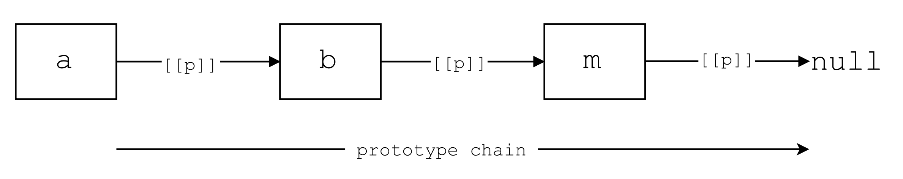

# Prototypes

There are different ways to interpret the prototype concept in JavaScript, but you can explain in it very easily in one sentence:

> "In JavaScript, prototypes are objects that facilitate the linking of objects"

That's really it. The most confusing part about the prototype concept is just the terminology, but the concept itself pretty straightforward. The diagram below demonstrates the idea in more details:



- The boxes represent objects
- The arrow shows the link direction: `a` links to `b`, `b` links to `c`, `c` links to `m`
- The links form the prototype chain for these objects
- `m` is the mother object which contains all the methods common to all objects
- `[[p]]` is the internal property of an object that points to another object. Confusingly enough, this property is known as the `[[prototype]]` in the specification
- In this diagram, `b` is known as the prototype of `a`, `c` the prototype of `b` and `m` the prototype of `c`.
- Property and method look up follows the prototype chain. That is, if you want to look up a property in `a`, JavaScript will first look at `a` itself. If it cannot find it there, it will then look at `b`. If it can't find it in `b`, it will then look in `c`. If it can't find it there, it will look in `m`, and eventually if it can't find it in `m`, it will return `undefined` because `m` is the 'mother object' and is not linked to any other object.
- But if you want to look up a property in 'c', JavaScript will not look into `a` or `b`. It will follow the link direction and if it can't find it in 'c', it will look in `m`, and will return `undefined` if it cannot find it in `m`.
- The `m` object is a special object which comes from `Object.prototype`. But don't worry about it now, we have enough prototype jargon lying around already :)

That was the Prototype concept in a nutshell. Now let's dive in and learn how we can link objects.

## Linking Objects

When you create any objects, behind the scenes JavaScript links your object to the 'mother object' automatically:

```javascript
var user = {
  name: 'Amin'
};
```

Roughly speaking, this is what happens behind the scenes:


- The `user` object gets linked to the 'mother' object
- Object `m` is known as the prototype of `user`
- You can get the prototype of `user` using the `Object.getPrototypeOf` method, that is: `Object.getPrototypeOf(user)`
- The 'mother' object is the `prototype` property of the `Object` constructor function object (WO!)
- You can double check the prototype of `user` using: `Object.getPrototypeOf(user) === Object.prototype // -> true`

As you can see, the terminology can get very confusing, so let's not get caught up with the jargon here. What's important is that fact that objects can be linked to each other and  an object can delegate responsibilities to other objects. That is the core of the idea and don't let the jargon confuse you.

Now that you know a little bit about what happens behind the scenes, let's create our own objects and link them together. In JavaScript there are two main ways to link objects. The first one has been available since ES5 and that is `Object.create`. Let's create two objects `a` and `b`, and link `a` to `b`. Because we are linking `a` to `b`, object `b` will be the prototype of `a`:

```javascript
// a -> b: b is the prototype of a.
// defining object `b` who is going to be the prototype of `a`
var b = {
  hello: function () {
    return 'hello';
  }
};
// create `a` and link it to `b`
var a = Object.create(b);
```

That's all it takes to link `a` to `b`. So now if we call `a.hello()`, first JavaScript will look at `a`, and because the `hello` method doesn't exist on `a`, it will then look at `b` and it will invoke the method. Also remember that `b` is automatically linked to the 'mother' object, so when we call, `a.toString()`, JavaScript will look up all the way from `a` to `m` and then it will invoke the method using the implementation in `m`. You can override any method, so let's provide our own `toString` method for `a`:

```javascript
a.toString = function () {
  return 'I am a.';
};
```

So now when we call `a.toString` we get back `I am a`. Now let's look at the other common way to link objects.

The other way of linking objects is using constructor function objects. We are going to do the same example as above, but instead we are going to use a more common way of creating it. So first, let's create the prototype object, that is object `b`. The funny thing is, to create this object first you need to create a function:

```javascript
var F = function () {};
```

Then, you need to get access to a special property on the function, which is created when you create any function in JavaScript. This property, not surprisingly, is called `prototype`:

```javascript
var b = F.prototype;
b.hello = function () {
  return 'hello';
};
```

Now that we have a prototype object, we can create object `a` by invoking the `F` function using the `new` keyword:

```javascript
var a = new F();
```

Because this pattern is so common, you don't need to create a reference to `F.prototype`. You can just add methods to `F.prototype` and then create an object using the function:

```javascript
var F = function () {};
F.prototype.hello = function () {
  return 'hello';
};
var a = new F();
// a -> F.prototype -> Object.prototype -> null
// a ->       b     ->          m       -> null
a.hello(); // -> 'hello'
```

That's it! Now we have linked `a` to `b` and `b` is the prototype of `a`. It might look a little bit weird but that's the mechanism that JavaScript uses to link objects. Maybe now it makes more sense why the `m` object is `Object.prototype`. The reason is that `Object` is a function who, just like any other function, has a property called prototype. So when you create a plain old object for example, it gets linked to `Object.prototype`. It is equivalent to the following:

```javascript
var myObj = Object.create(Object.prototype);
// or
var myObj = new Object();
// Object.getPrototypeOf(myObj) === Object.prototype // -> true
```
The great thing is that this mechanism is consistent throughout JavaScript and that explains a lot of things about JavaScript. Let's explore those in the next section.

## Prototypes Inside JavaScript

JavaScript internally has several functions that it uses as constructors. Some of these functions are:

```javascript
Boolean
Number
String
Object
Function
```


