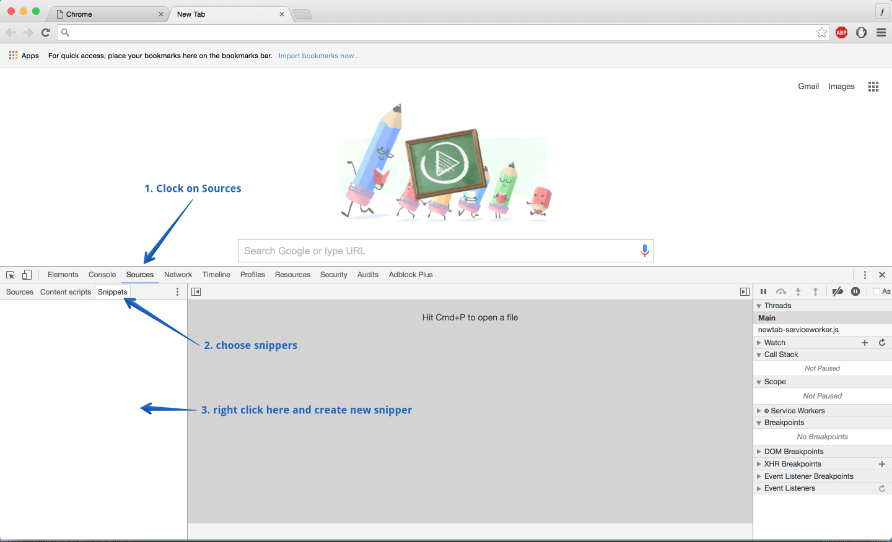
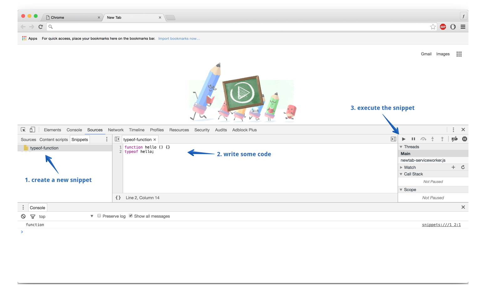

# Preface

There is no doubt that JavaScript has grown to become one of the most important programming languages today. Yet, surprisingly enough, there are many who consider methodical learning of JavaScript unnecessary. This is very surprising, even so now in 2016 that JavaScript has improved dramatically since 1995 when it was first released. This trend seems to be prevalent in many venues, but it doesn't have to be that way. One of the goals of this book is to point you in the right direction by focusing on the three very important concepts in JavaScript, namely functions, closures, and prototypes. Hopefully, by the end of the book you will feel comfortable with these concepts and find yourself enabled to to go ahead and use them effectively in your own programs. In addition, there is a bonus chapter listing interview questions that are often asked in many interviews for any JavaScript or front-end related position. You can use that chapter to evaluate yourself and revisit the chapters or sections as necessary.

## Book overview

In *Chapter 1* we will explore all the fundamental concepts related to functions, including function objects, function declarations and expressions, the `this` keyword and more.

In *Chapter 2* we will learn what closures are, why they are useful, and how you can use them in your programs.

In *Chapter 3* we will look at probably the most important concept in JavaScript, that is the prototypes. We will learn what they are, why they make JavaScript so different than class-oriented languages, and how you can use them to simplify the design of your programs.

## How to read this book

Every chapter of the book opens with a list of bullet points of important concepts. Each bullet point is then explored in detail through the chapter. You may find the book very dry in nature, so may want to take breaks while reading. Although you may want to read chapters out of order, or just skim through the chapters, please don't. Please take your time, study each chapter slowly, and take breaks frequently if you find yourself unmotivated. The book is designed this way to serve as a reference so that you can refer to any time in the future. Also, keep in mind that the book is always up-to-date with the latest spec of the language, which is currently ES2015. I genuinely hope you get something out of the book, and please submit an issue if you don't understand something, or if you find a spelling error or a mistake in the code. The book is written in Markdown and is hosted in github: https://github.com/aminmeyghani/js-fn-book

Happy coding :)

## Requirements

In order to follow along with the book, you need the following:

- Google Chrome
- Node > 5
- A text editor (Sublime Text is recommended, but not necessary)

Below, you can find useful information about Chrome DevTools and installing Node. Since we will be using them throughout the book, please take the time to make sure that you have all of them set up.

### Using Chrome DevTools

You can run JavaScript code in Chrome DevTools. You can either use the console or the snippets tab to create snippets of JavaScript code. In order to use the console, open Chrome, right click on the page, and choose inspect. Once you do that, the DevTools opens up. Once the DevTools is open, click on the Console tab to open the Console. Once the Console tab opens, you can run JavaScript code one line at a time. The screenshot below demonstrates how to find the Console tab:


In addition to the Console, you can use the snippets tab to create snippets of code and execute them. In order to create a new snippet, click on the Snippet tab, and then right click in the empty area to create a new snippet. The screenshot below shows you how to create a new snippet:



After you created a snippet, you can write some code and execute it by either clicking on the run button on the right hand side of the DevTools, or using the `command + enter` shortcut. The screenshot belows demonstrates how to run the snippet:



### Installing Node

Node is a JavaScript run-time that you can use to execute JavaScript scripts. The easiest way to install and manage Node is with [nvm](https://github.com/creationix/nvm). You can use the following to install NVM:

```bash
curl -o- https://raw.githubusercontent.com/creationix/nvm/v0.31.0/install.sh | bash
```

After that, make a new terminal and make sure that `nvm` is installed with `nvm --version`. If you don't get any output, try adding the following to your `~/.bash_profile` file:

```bash
export NVM_DIR=~/.nvm
source $(brew --prefix nvm)/nvm.sh
```

After NVM is installed, you can use it to install any Node version that you need. For example, to install the latest version 5, run:

```bash
nvm install 5
```
That's it! Now, if you want to set this version as your machine default, run the following:

```bash
nvm alias default 5
```

Now that you have Node installed, you can execute Node scripts. For example, make a file on your desktop called `script.js`:

```bash
touch ~/Desktop/script.js
```

Then add the following to the file:

```javascript
console.log('hello world');
```

Then execute the script with `node ~/Desktop/script.js` and you should see the output in the terminal. That's it.

**TODO**

