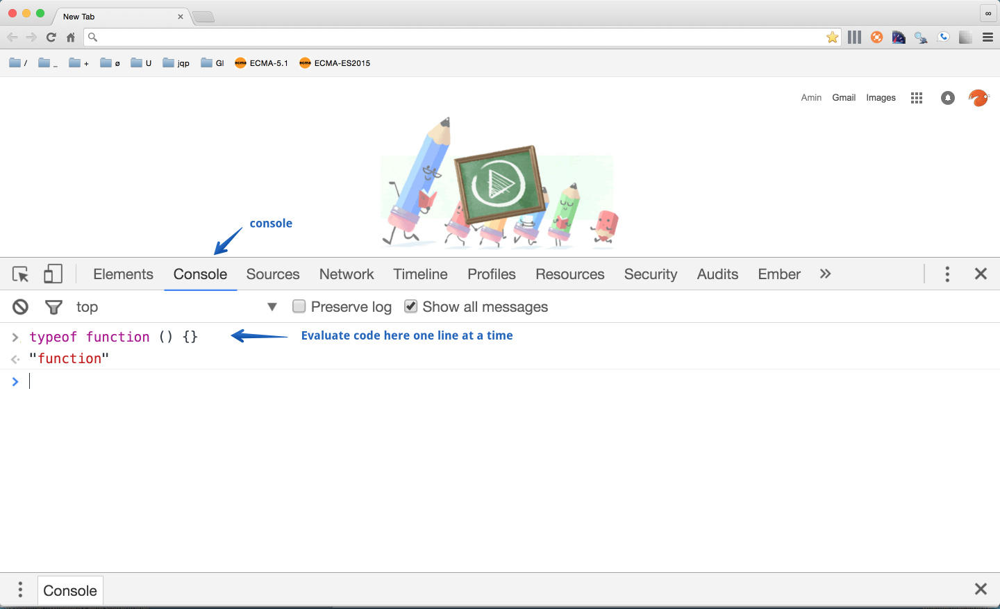
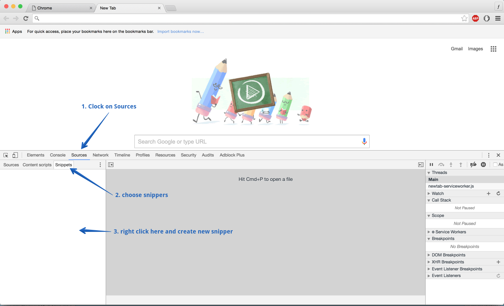
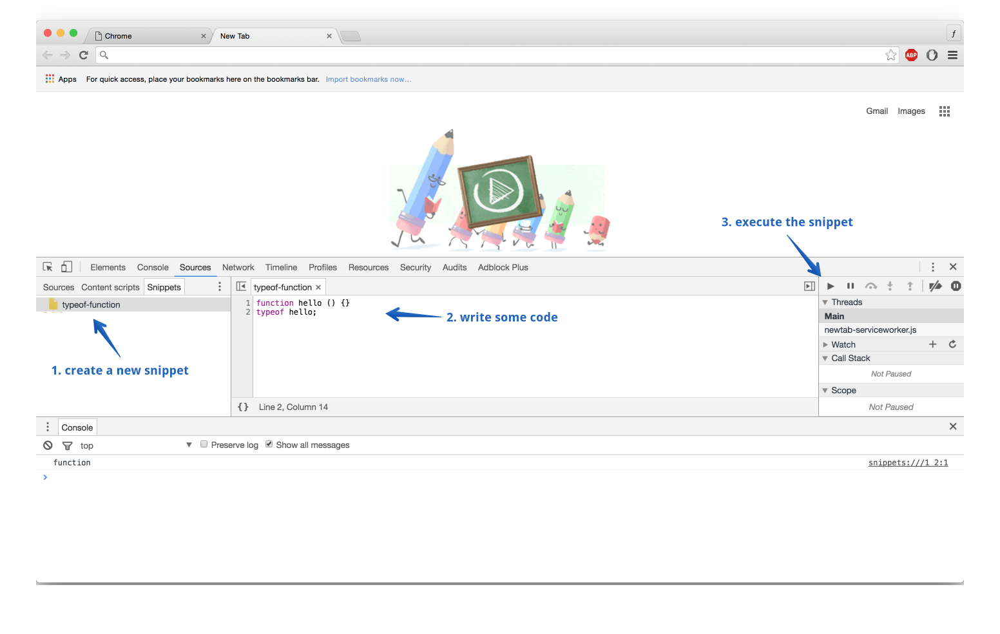

# Welcome

Welcome to functions, closures, and prototypes in JavaScript.

## Outline

In *Chapter 1* we will explore the fundamentals of functions. How to create functions, how to execute them, how to use them as objects and more.

In *Chapter 2* we will look at closures.

In *Chapter 3* we will look at prototype objets.

## Setup

You can use the Chrome dev tools to interact with JavaScript. You can also install Node on your machine and interact with it in the terminal.

### Running JavaScript in Chrome DevTools

You can run JavaScript code in Chrome DevTools. You can either use the console or the snippets tab to create snippets of JavaScript code. In order to use the console, open Chrome, right click on the page, and choose inspect. Once you do that, the DevTools opens up. Once the DevTools is open, click on the Console tab to open the Console. Once the Console tab opens, you can run JavaScript code one line at a time. The screenshot below demonstrates how to find the Console tab:

In addition to the Console, you can use the snippets tab to create snippets of code and execute them. In order to create a new snippet, click on the Snippet tab, and then right click in the empty area to create a new snippet. The screenshot below shows you how to create a new snippet:

After you created a snippet, you can write some code and execute it by either clicking on the run button on the right hand side of the DevTools, or using the `command + enter` shortcut. The screenshot belows demonstrates how to run the snippet:

### Running JavaScript with Node

**TODO**

