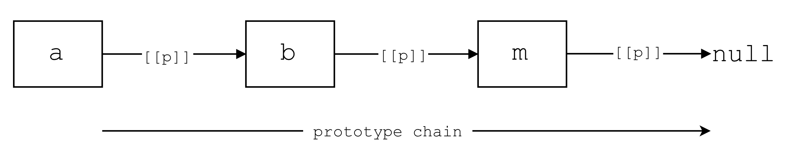

# Prototypes

There are different ways to interpret the prototype concept in JavaScript, but you can explain in it very easily in one sentence:

> "In JavaScript, prototypes are objects that facilitate linking of objects and delegation of methods or properties"

That's really it. The most confusing part about the prototype concept is just the terminology, but the concept itself is pretty straightforward. The diagram below demonstrates the idea in more detail:



- The boxes represent objects
- The arrow shows the link direction: `a` links to `b`, `b` links to `c`, `c` links to `m`
- The links form the prototype chain for these objects
- `m` is the mother object which contains all the methods common to all objects
- `[[p]]` is the internal property of an object that points to another object. Confusingly enough, this property is known as the `[[prototype]]` in the specification
- In this diagram, `b` is known as the prototype of `a`, `c` the prototype of `b` and `m` the prototype of `c`.
- Property and method look up follows the prototype chain. That is, if you want to look up a property in `a`, JavaScript will first look at `a` itself. If it cannot find it there, it will then look at `b`. If it can't find it in `b`, it will then look in `c`. If it can't find it there, it will look in `m`, and eventually if it can't find it in `m`, it will return `undefined` because `m` is the 'mother object' and is not linked to any other object.
- But if you want to look up a property in `c`, JavaScript will not look into `a` or `b`. It will follow the link direction and if it can't find it in `c`, it will look in `m`, and will return `undefined` if it cannot find it in `m`.
- The `m` object is a special object which comes from `Object.prototype`. But don't worry about it now, we have enough prototype jargon lying around already :)

That was the Prototype concept in a nutshell. Now let's dive in and learn how we can link objects.

## Linking Objects

When you create any objects, behind the scenes JavaScript links your object to the 'mother object' automatically:

```javascript
var user = {
  name: 'Amin'
};
```

Roughly speaking, this is what happens behind the scenes:


- The `user` object gets linked to the 'mother' object
- Object `m` is known as the prototype of `user`
- You can get the prototype of `user` using the `Object.getPrototypeOf` method, that is: `Object.getPrototypeOf(user)`
- The 'mother' object is the `prototype` property of the `Object` constructor function object (WO!)
- You can double check the prototype of `user` using: `Object.getPrototypeOf(user) === Object.prototype // -> true`

As you can see, the terminology can get very confusing, so let's not get caught up with the jargon here. What's important is that fact that objects can be linked to each other and  an object can delegate responsibilities to other objects. That is the core of the idea and don't let the jargon confuse you.

Now that you know a little bit about what happens behind the scenes, let's create our own objects and link them together. In JavaScript there are two main ways to link objects. The first one has been available since ES5 and that is `Object.create`. Let's create two objects `a` and `b`, and link `a` to `b`. Because we are linking `a` to `b`, object `b` will be the prototype of `a`:

```javascript
// a -> b: b is the prototype of a.
// defining object `b` who is going to be the prototype of `a`
var b = {
  hello: function () {
    return 'hello';
  }
};
// create `a` and link it to `b`
var a = Object.create(b);
```

That's all it takes to link `a` to `b`. So now if we call `a.hello()`, first JavaScript will look at `a`, and because the `hello` method doesn't exist on `a`, it will then look at `b` and it will invoke the method. Also remember that `b` is automatically linked to the 'mother' object, so when we call, `a.toString()`, JavaScript will look up all the way from `a` to `m` and then it will invoke the method using the implementation in `m`. You can override any method, so let's provide our own `toString` method for `a`:

```javascript
a.toString = function () {
  return 'I am a.';
};
```

So now when we call `a.toString` we get back `I am a`. Now let's look at the other common way to link objects.

The other way of linking objects is using constructor function objects. We are going to do the same example as above, but instead we are going to use a more common way of creating it. So first, let's create the prototype object, that is object `b`. The funny thing is, to create this object first you need to create a function:

```javascript
var F = function () {};
```

Then, you need to get access to a special property on the function, which is created when you create any function in JavaScript. This property, not surprisingly, is called `prototype`:

```javascript
var b = F.prototype;
b.hello = function () {
  return 'hello';
};
```

Now that we have a prototype object, we can create object `a` by invoking the `F` function using the `new` keyword:

```javascript
var a = new F();
```

Because this pattern is so common, you don't need to create a reference to `F.prototype`. You can just add methods to `F.prototype` and then create an object using the function:

```javascript
var F = function () {};
F.prototype.hello = function () {
  return 'hello';
};
var a = new F();
// a -> F.prototype -> Object.prototype -> null
// a ->       b     ->          m       -> null
a.hello(); // -> 'hello'
```

That's it! Now we have linked `a` to `b` and `b` is the prototype of `a`. It might look a little bit weird but that's the mechanism that JavaScript uses to link objects. Maybe now it makes more sense why the `m` object is `Object.prototype`. The reason is that `Object` is a function who, just like any other function, has a property called prototype. So when you create a plain old object for example, it gets linked to `Object.prototype`. It is equivalent to the following:

```javascript
var myObj = Object.create(Object.prototype);
// or
var myObj = new Object();
// Object.getPrototypeOf(myObj) === Object.prototype // -> true
```
The great thing is that this mechanism is consistent throughout JavaScript and that explains a lot of things about JavaScript. Let's explore those in the next section.

## Prototype Objects Inside JavaScript

JavaScript internally has several functions that it uses as constructors. The most common ones are:

- `Boolean`
- `Number`
- `String`
- `Object`
- `Function`

Note that all of these functions, correspond to the fundamental data types in JavaScript:

- Primitive Data Types:
    - boolean
    - number
    - string
- Non-primitive Date Types
    - object (functions are objects too)


The most important point here is that all the methods that are available on the data types come from the value of the `prototype` property of the constructor function. Also note that constructor functions always start with an uppercase letter. Let's look at some examples.

You know that strings are primitive values, yet you can call methods on strings:

```javascript
var str = 'hello';
str.replace('o', 'oo'); // -> helloo
```

First of all, how can we call the `replace` method on the string, if `str` is a primitive value? Second of all, where does the `replace` method come from? In order to answer the first question, we need to learn how JavaScript can coerce one type to another. When you create a primitive string value and assign it to the variable `str`, nothing happens until you use the dot operator on the reference. Then JavaScript coerces the primitive string to the equivalent object by wrapping it with the corresponding constructor function. So in this case, roughly speaking, JavaScript does the following to the primitive value:

```javascript
var str = new String('hello');
```

And that's why you can call the method on `str` because it is an object for a short period of time until it is garbage collected. Now, that we know what happens behind the scenes, it might be easier to answer the second question: where does the `replace` method come from ? The answer is, it comes from `String.prototype` and if you think about it, the answer is consistent to what we learned in the previous section. And since JavaScript is dynamic, you can add a method to `String.prototype` object and magically all the pre existing strings in your code, have a new method. This is not generally recommended, but let's demonstrate this by adding a new method on `String.prototype` called `first` that returns the first character of a given string:

```javascript
String.prototype.first = function () {
  return this.charAt(0);
};
str.first(); //-> 'h'
```

As you can see, this mechanism is consistent across JavaScript, that is, for anything out there in JavaScript, there is a constructor function that has a prototype property that contains the methods to be used by all the instances. If you understand this concept, you will understand the core of JavaScript and how it works. Now, just for fun, here are some more objects with their corresponding prototype chains:

- `Array`

```javascript
const nums = [1,2,3];
// nums -> Array.prototype -> Object.prototype -> null
```

You can get the list of properties on `Array.prototype` with:

```javascript
Object.getOwnPropertyNames(Array.prototype);
//->
/*
["length", "constructor", "toString", "toLocaleString", "join", "pop", "push", "reverse",
"shift", "unshift", "slice", "splice", "sort", "filter", "forEach", "some", "every",
"map", "indexOf", "lastIndexOf", "reduce", "reduceRight", "copyWithin", "find",
"findIndex", "fill", "includes", "entries", "keys", "concat", "values"]
 */
```

It is interesting to note here that Arrays have their own `toString` method that is different from `Object.prototype.toString` method.

- `Promise`

```javascript
const myPromise = new Promise((resolve, reject) => {
  resolve('hello')
});
// myPromise -> Promise.prototype -> Object.prototype -> null
```

- `Date`

```javascript
const today = new Date();
today.getTime(); // -> 1467023558413
// today -> Date.prototype -> Object.prototype -> null
```

Now that we have a better understanding of the prototype concept in JavaScript, let's dive deeper and explore more interesting topics.

## Inheritance

You can mimic the classical inheritance model in JavaScript with prototype objects. We are just going to demonstrate that here and we won't dive into it since the classical inheritance model does not really fit JavaScript but we are just going to show that here because many seem to use this pattern. After that we will demonstrate functional mixins which are much flexible and dynamic way of achieving inheritance in JavaScript.

For this example, we are going to have a `Person` base type, and create a `Worker`,  `Designer`, and `Developer` type which all would inherit from `Person`. First, let's draw a simple diagram to understand the relationship between these types:

```javascript
var developer = new Developer();
/*
 * null
 *  ↑
 * Object.prototype
 *  ↑
 * Person.prototype
 *  ↑
 * Worker.prototype
 *  ↑
 * Developer.prototype
 *  ↑
 * developer
 */
```

A Developer has all the methods of:

- a developer
- a worker
- a person

Note that all we need to do is to link some objects and these objects are the `prototype` property of each constructor function. That's what makes delegation possible and efficient in terms of memory usage:

```javascript
function Person () {}
Person.prototype.walk = function () {
  return 'walking ...';
}

function Worker() {}
Worker.prototype = Object.create(Person.prototype);

Worker.prototype.work = function () {
  return 'working ....';
}

function Developer () {}
Developer.prototype = Object.create(Worker.prototype);
Developer.prototype.code = function () {
  return 'coding ....';
}

var dev = new Developer();
dev.code(); // 'coding ...'
dev.work(); // 'working ...'
dev.walk(); // 'walking ...'
```

Also note that you can just simply link objects together, and it would have the same effect:

```javascript
var person = {
  walk() { return 'walking...';}
};

var worker = Object.create(person);
worker.work = function () {
  return 'working';
}

var dev = Object.create(worker);
dev.code = function () {
  return 'coding...';
}
dev.code(); // 'coding ...'
dev.work(); // 'working ...'
dev.walk(); // 'walking ...'
```

The difference is that we only have one instance of the developer and we don't have a function to create more instances of a `Developer` for us. You could wrap this in a function, but JavaScript already has a mechanism and that is linking prototype objects and using constructor functions.

Another important thing to remember is using the `new` keyword. Almost in call cases, you want to hide that away and not force the consumers of your API to use `new` to create instances:

```javascript
function Developer (name) {
  if (!(this instanceof Developer)) {
    return new Developer(name);
  }
  this.name = name;
}
```

By doing those, consumers won't have to call the constructor with `new` which is cleaner and also eliminates the possibility of `this` to be bound to the global object. The other important thing to note is how `this` is bound when the function is invoked with the `new` keyword. When the constructor function is invoke with the `new` keyword, the context object, `this` always refers to the instance. In the example above, we assign the name property of the instance to what is passed. Each instance will get their own names but they will all share the same prototype that enables them efficiently call methods without the need of copying methods to each instance.


That's pretty much all you need to know to be able to use prototype objects. However, you should be aware of great libraries out there, such as [Stampit](https://github.com/stampit-org/stampit) that are much more powerful and flexible than the classical approach and allow you to do much more. In the next section we will explore the effect of inheritance through functional mixins.

## Functional Mixins Over Classical Inheritance

The core idea behind mixins is that you can augment an existing entity with another. Now this entity can be anything, a plain object, a function, or a prototype object. You can either mixin objects with each other or mixin an object with functions. In this section we are going to focus on functional mixins since they are very flexible and convenient when working with JavaScript. In addition, functional mixins are very different than classical inheritance and introduce a different a way of thinking.

The idea behind functional mixins is very simple: you define a bunch of functionalities, and you specify the context to which these functions apply. Let's look at a very simple example:

```javascript
/*
 * Define functionalities
 * Grouped by `fns` here.
 */
function fns() {
  this.getName = function() {
    return this.name;
  };
}

/* Define Type */
function Person(name) {
  if (!(this instanceof Person)) {
    return new Person(name);
  }
  this.name = name;
}

/* Apply the functionalities to the
prototype object of Person */
fns.call(Person.prototype);

/* make an instance of Person */
const person = Person('Amin');

/* call methods */
person.getName() //-> 'Amin'
```

In the example above, we first create a function that contains the functionalities of a type. Then we define the type and finally we apply the functionalities to the type by calling the `fns` function in the context of the type's prototype object. That's all it takes to add functionalities to the type. Now the interesting thing to note here is that you can create more functions and group other pieces of functionalities and then apply it to the type. In order to demonstrate that, let's redo the example in the previous section with this functional mixins.

If you remember from the previous section, we created the `Developer` type that had the functionalities of a `Person`, `Worker`, and `Developer`. So, let's define the functionalities for each of these first:

```javascript
/* Define Person's functionalities */
function personFns() {
  this.walk = function () {
    return 'Walking ...';
  };
  this.getName = function () {
    return this.name;
  };
}

/* Define Worker's functionalities */
function workerFns() {
  this.work = function () {
    return 'Working ...';
  };
}

/* Define Developer's functionalities */
function developerFns() {
  this.code = function () {
    return 'Coding ...';
  };
}
```

Now that we have defined the groups of functionalities, then, we need to define the `Developer` type:

```javascript
/* Define the Developer type */
function Developer(name) {
  if (!(this instanceof Developer)) {
    return new Developer(name);
  }
  this.name = name;
  this.toString = function () {
    return this.name;
  };
}
```

After that, we need to apply each functionalities to the Developer's prototype:

```javascript
/* apply each functionalities to
Developer's prototype */
[personFns, workerFns, developerFns].forEach(fn => {
  fn.call(Developer.prototype);
});
```

Now we can create an instance of the `Developer` and call any of the methods:

```javascript
/* create an instance and call methods */
const dev = Developer('Amin');
console.log(dev.getName());
console.log(dev.walk());
console.log(dev.work());
console.log(dev.code());
console.log('Dev is: ' + dev);
```

After running the code above you should get the following output:

```bash
Amin
Walking ...
Working ...
Coding ...
Dev is: Amin
```

And that's how you can use functional mixins to augment a type. Also note that the context object `this`, always refers to the created instance object. Now that we have learned what functional mixins are, let's see how we can improve the performance by forming a closure around the mixins to cache the result of the first definition call:


```javascript
const personFns = (function() {
  function walk() {return 'Walking...';}
  function getName() {return this.name;}
  return function() {
    this.walk = walk;
    this.getName = getName;
    return this;
  };
}());

const workerFns = (function() {
  function work() {return 'working...';}
  return function() {
    this.work = work;
    return this;
  };
}());

const developerFns = (function() {
  function code() {return 'coding...';}
  return function() {
    this.code = code;
    return this;
  };
}());
```

All we did here was wrapping each function with a closure, the rest of the code is the same. Now, the effect that this has on performance is noticeable because when the outer function is called, there result is always cached because the inner function references the outer function methods.


